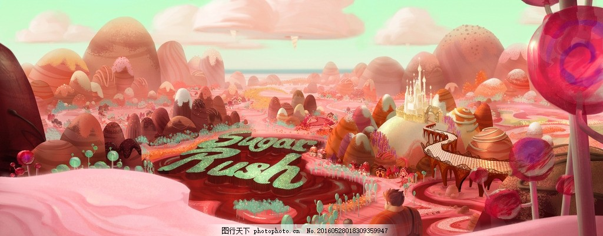
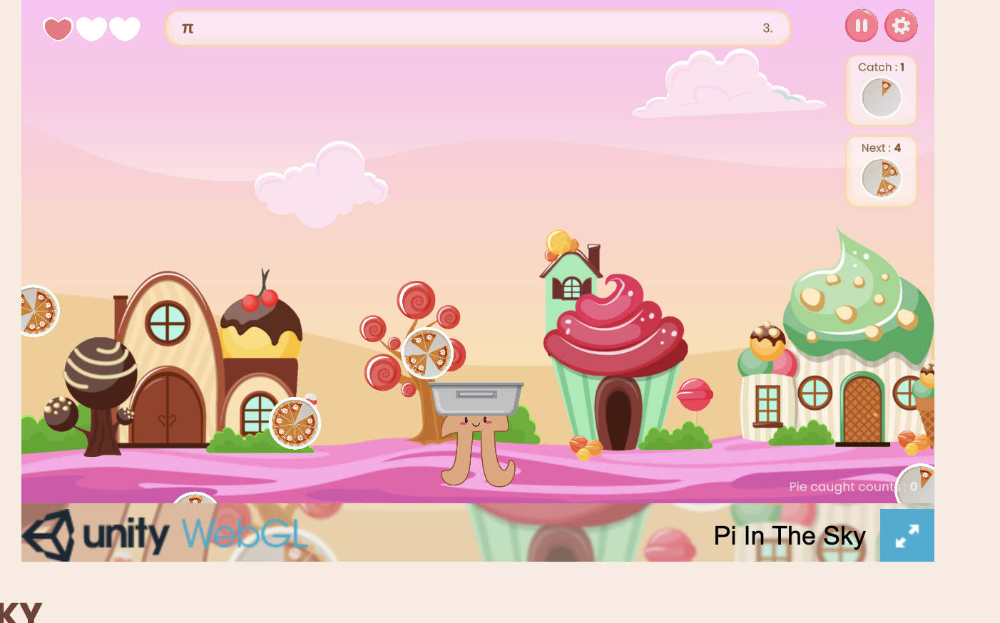

# yuyu0125_9103_tut10
__Part 1: Imaging Technique Inspiration__
I am inspired by "Wreck-It Ralph," especially the Sugar Rush world, and The Coding Train’s "Pi in the Sky" game challenge. I want to blend the bright, candy-themed visuals of Sugar Rush, full of whimsical landscapes made of sweets, with the gameplay mechanics of collecting pizza slices from "Pi in the Sky." This mix brings together a delightful visual feast that is both playful and inviting, with an innovative and enjoyable approach to game objectives. The colorful environment and interactive gameplay will make the project appealing and fun.

__Part 2: Coding Technique Exploration__
To implement the interactive and dynamic visuals for the game, I will utilize JavaScript along with the p5.js library, specifically focusing on its particle system and collision detection features. The particle system will be used to animate pizza slices falling through the game environment, creating a lively and engaging visual effect. Collision detection will allow the game to respond when the player successfully collects a pizza slice. These specific functionalities of p5.js are crucial for achieving the desired interactivity and playfulness, ensuring the game mechanics are both smooth and responsive.